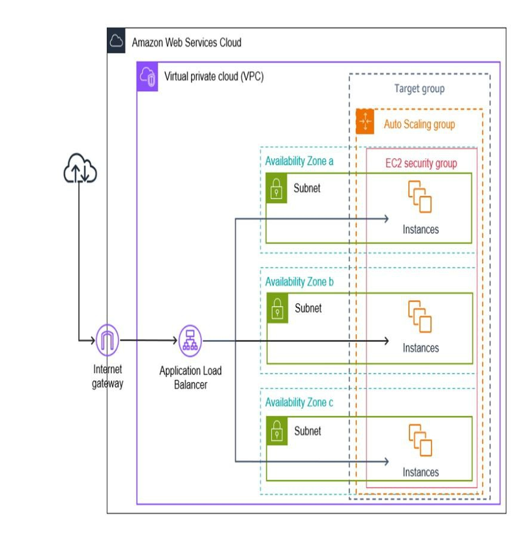
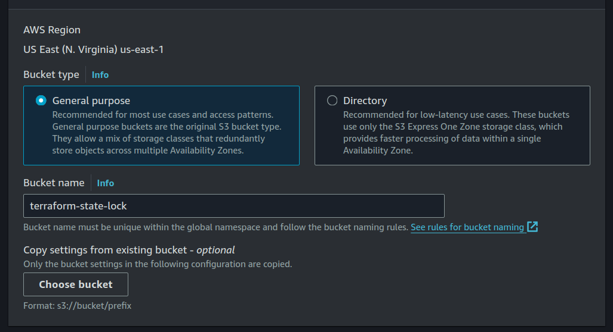
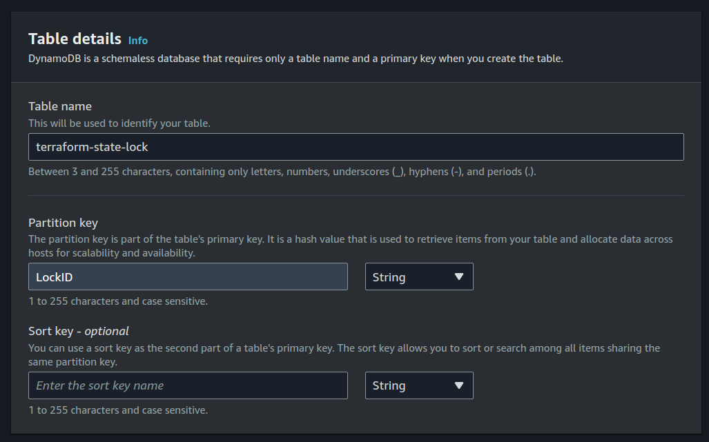

# DEPI Terraform AWS Project

This project automates the deployment of an AWS architecture using Terraform. The setup includes a Virtual Private Cloud (VPC) with subnets across multiple Availability Zones, an Application Load Balancer (ALB), EC2 instances, and Auto Scaling groups. This infrastructure is designed to ensure high availability and scalability for your applications.

## Table of Contents
- [Introduction](#introduction)
- [Architecture Overview](#architectureoverview)
- [Features](#features)
- [Prerequisites](#prerequisites)
- [Installation](#installation)
- [Usage](#usage)
- [Contributing](#contributing)
- [License](#license)
- [Contact](#contact)

## Introduction
This repository contains Terraform scripts to deploy a web application on AWS with high availability and autoscaling capabilities. The setup includes an EC2 instance, an Application Load Balancer (ALB), and an Auto Scaling Group (ASG).

## Architecture Overview
The architecture deployed by this project is shown in the diagram below:



- **Virtual Private Cloud (VPC)**: The entire infrastructure is hosted inside a VPC for network isolation.
- **Subnets**: Each Availability Zone has a dedicated subnet.
- **Application Load Balancer (ALB)**: Distributes incoming traffic across the EC2 instances in various Availability Zones.
- **EC2 Instances**: These are the compute resources where your application runs. Auto Scaling ensures these instances can scale dynamically based on traffic.
- **Auto Scaling Group**: Automatically adjusts the number of EC2 instances based on load.
- **Security Groups**: Define the access control rules for the EC2 instances.

## Features
- **High Availability**: Ensures the application is available across multiple availability zones.
- **Autoscaling**: Automatically adjusts the number of EC2 instances based on load.
- **Load Balancing**: Distributes incoming traffic across multiple instances to ensure no single instance is overwhelmed.
- **S3 Bucket**: Used for storing the Terraform state files.
- **DynamoDB Table**: Used for state locking to ensure safe concurrent operations.

## Prerequisites
- [Terraform](https://www.terraform.io/) installed.
- AWS account with appropriate permissions.
- AWS CLI configured with your credentials.

## Installation
1. Clone the repository:
    ```bash
    git clone https://github.com/Moe-404/depi-aws-ha-autoscaling-webapp.git
    cd depi-aws-ha-autoscaling-webapp
    ```
2. Create S3 Bucket
   
3. Create DynamoDb Table
   
4. Initialize Terraform:
    ```bash
    terraform init
    ```
5. Plan the deployment:
    ```bash
    terraform plan
    ```
6. Apply the configuration:
    ```bash
    terraform apply
    ```

## Usage
Once deployed, the Application Load Balancer distributes traffic to the EC2 instances. The infrastructure automatically scales based on traffic.

To destroy the infrastructure:
```bash
terraform destroy
```

## License
This project is licensed under the MIT License. See the LICENSE file for details.

## Contact
For any questions or suggestions, feel free to open an issue or contact the repository owner.
